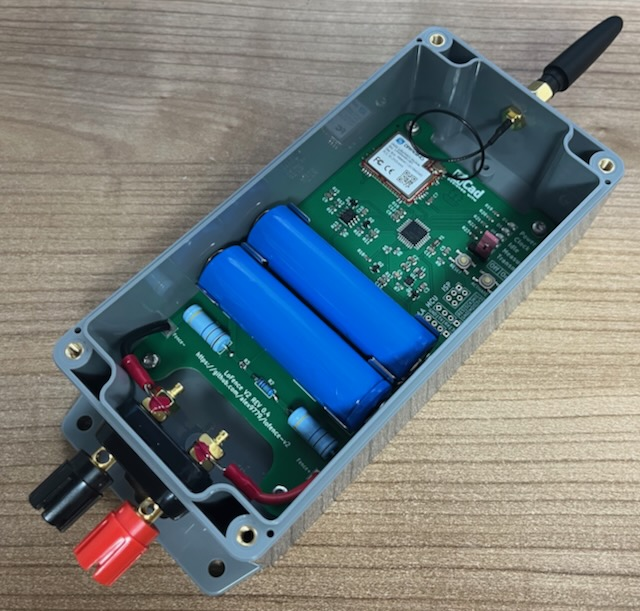

# LoFence V2

LoFence V2 is an updated version of the original [LoFence](https://github.com/kiu/lofence/) tackling a few shortcomings.

The main improvements are:

- case lid can be opened while main body is mounted,
- two batteries for a longer operating time,
- battery deep discharge protection using an activation circuit with a button triggered from the firmware when batteries run low,
- fully revised firmware with ability to change operating parameters by downlinks.

Other things changed are:

- Exchange RN2483 module for Dragino LA66.
  - I always had some problems with the RN2483 though serial communication protocol was easier to work with.
  - LA66 has antenna connector on board so I don't have to care about a correct antenna circuit which also has to follow the guidelines to not to violate regulatory approvals.
  - LA66 is a little cheaper.
- Implement probe resistor divider erratum.
- Optimized for assembling.
  - Changed various components to SMD variants.
  - Switch to buck-boost converter for power supply.
  - Use clamps for holding batteries instead of full holder.

For information how to build a LoFence V2 device see the [hardware repository](https://github.com/Alex9779/LoFence_Hardware).

For information how to build, upload or configure the firmware see the [firmware repository](https://github.com/Alex9779/LoFence_Firmware).

## WARNING

Do not let the debug LEDs activated during normal operation!

They need a lot of current compared to the overall device's current usage. So if activated they drastically reduce the battery runtime to just some weeks or even days.

## Device activation

The LoFence V2 is equipped with an activation circuit allowing the device to deactivate itself if the battery voltage goes under a configured level (3400mV by default for 5 cycles or 3100mV as an absolute minumum) to prevent the battery from deep discharge.

Therefore the device does not automatically activate if a battery is put in but you have to push and hold the *ACTIVATE* button for at least 1 second.

If the debug LEDs are activated the *IDLE* LED indicates that the activation process has been completed when it goes out.

After activation the device tries to join (re-join) the network, LoRaWAN counters are reset.

If joining succeeds the device will immediately do the first measurement and after that transmits the first uplink.

## Device resetting

To reset the device push the *RESET* button. After a reset the device has to be activated again.

A reset is just the same as removing all batteries and put them back in and activate the device.
